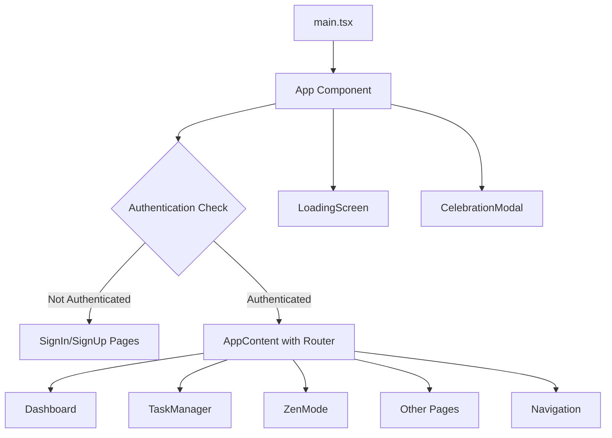
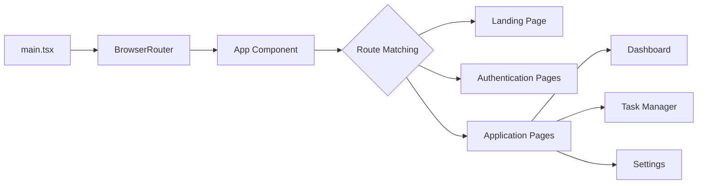
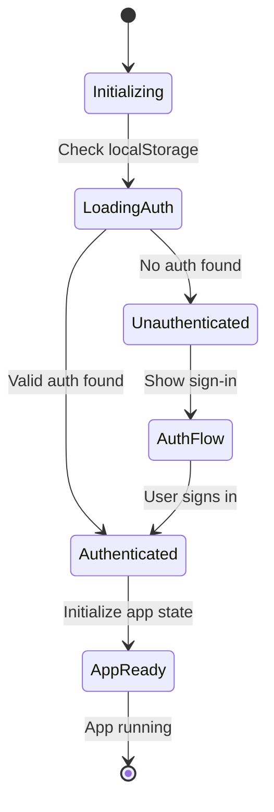
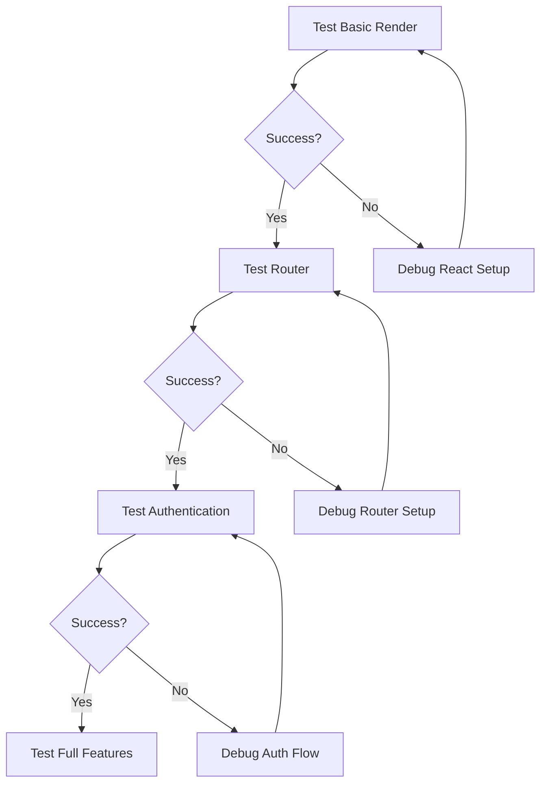

# Blank Screen Issue Resolution Design

## Overview

The NeuroFlow ADHD web application is experiencing a blank screen issue where the React application fails to render properly. Based on analysis of the codebase, several potential root causes have been identified that require systematic resolution to restore full application functionality.

The application is a React-based frontend built with Vite, TypeScript, and Tailwind CSS, serving as a comprehensive ADHD management tool with features including task management, zen mode, sound library, and user authentication.

## Repository Type

**Frontend Application** - React with TypeScript, using Vite as build tool and router-based navigation

## Architecture

The application follows a standard React SPA architecture with the following key components:

### Application Structure
| Component | Purpose | Status |
|-----------|---------|---------|
| main.tsx | Entry point with React initialization | Contains debugging code |
| App.tsx | Root component with routing | Has fallback minimal version |
| Router System | React Router for navigation | Complex routing logic |
| Authentication | Sign-in/Sign-up flow | Integrated with app state |
| State Management | Local state with localStorage persistence | Complex initialization |

### Component Hierarchy

## Root Cause Analysis

### Identified Issues

| Issue Category | Specific Problems | Impact Level |
|----------------|------------------|--------------|
| **React Initialization** | Complex error handling masking real issues | High |
| **Component Complexity** | App.tsx has two different implementations | Critical |
| **State Management** | Complex initialization logic with localStorage | High |
| **Router Configuration** | Missing Router wrapper in main component | Critical |
| **Import Dependencies** | Multiple component imports that may fail | Medium |
| **CSS/Styling** | Tailwind CSS classes not loading | Medium |

### Primary Root Causes

1. **Missing Router Wrapper**: The App component uses React Router components but isn't wrapped in a Router
2. **Dual App Implementation**: App.tsx contains both complex and minimal versions causing confusion
3. **Initialization Race Conditions**: Complex state initialization may fail before React renders
4. **Import Chain Failures**: Deep import dependencies may cause module loading failures

## Resolution Strategy

### Phase 1: Simplification and Isolation

**Objective**: Establish a minimal working React application to confirm basic functionality

**Approach**:
- Simplify main.tsx to essential React rendering
- Use the minimal App component version temporarily
- Remove complex initialization logic
- Verify basic React rendering works

### Phase 2: Router Integration

**Objective**: Restore routing functionality with proper Router wrapper

**Approach**:
- Wrap App component in BrowserRouter at the main.tsx level
- Restore basic routing structure
- Test navigation between simple pages

### Phase 3: State Management Restoration

**Objective**: Gradually restore application state and authentication

**Approach**:
- Implement simple state initialization
- Add authentication flow step by step
- Test localStorage integration
- Restore complex features incrementally

### Phase 4: Component Integration

**Objective**: Restore full application functionality

**Approach**:
- Re-integrate all page components
- Restore navigation component
- Test all application features
- Verify responsive design and styling

## Implementation Strategy

### Router Architecture Design

### State Management Flow

### Error Handling Strategy

| Error Type | Detection Method | Recovery Action |
|------------|------------------|-----------------|
| **React Render Failure** | Empty root element after render | Show fallback UI with error message |
| **Import Failures** | Module loading errors | Progressive component loading |
| **State Corruption** | JSON parse errors | Clear localStorage and restart |
| **Router Errors** | Navigation failures | Redirect to landing page |

## Testing Strategy

### Verification Steps
1. **Basic React Rendering**: Confirm minimal component displays
2. **Router Functionality**: Test navigation between pages
3. **Authentication Flow**: Verify sign-in/sign-up process
4. **State Persistence**: Test localStorage functionality
5. **Component Loading**: Verify all pages load correctly
6. **Responsive Design**: Test mobile and desktop layouts

### Progressive Testing Approach

## Risk Mitigation

### Potential Risks
| Risk | Probability | Impact | Mitigation Strategy |
|------|-------------|--------|-------------------|
| **Data Loss** | Low | High | Backup localStorage before changes |
| **Breaking Changes** | Medium | High | Implement changes incrementally |
| **Browser Compatibility** | Low | Medium | Test across major browsers |
| **Performance Issues** | Medium | Low | Monitor bundle size and load times |

### Rollback Strategy
- Maintain current debugging code until resolution confirmed
- Implement changes in feature branches
- Test each phase thoroughly before proceeding
- Keep minimal working version as fallback

## Configuration Requirements

### Build Tool Configuration
- Vite configuration appears correct
- React plugin properly configured
- TypeScript compilation settings appropriate

### Dependency Management
- All required dependencies present in package.json
- React Router version compatible
- No obvious version conflicts identified

### Environment Setup
- Development server: `npm run dev` or `yarn dev`
- Production build: `npm run build`
- Local testing: http://localhost:5173 (default Vite port)

## Success Criteria

### Functional Requirements
- [ ] Application loads without blank screen
- [ ] User can navigate between all pages
- [ ] Authentication flow works correctly
- [ ] Task management features operational
- [ ] Settings and preferences persist
- [ ] Responsive design functions properly

### Performance Requirements
- [ ] Initial page load under 3 seconds
- [ ] Navigation transitions smooth
- [ ] No console errors during normal operation
- [ ] localStorage operations complete successfully

### User Experience Requirements
- [ ] Loading states display appropriately
- [ ] Error messages are user-friendly
- [ ] Application recovers gracefully from errors
- [ ] Theme switching works correctly