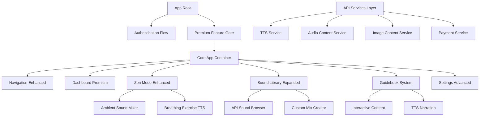
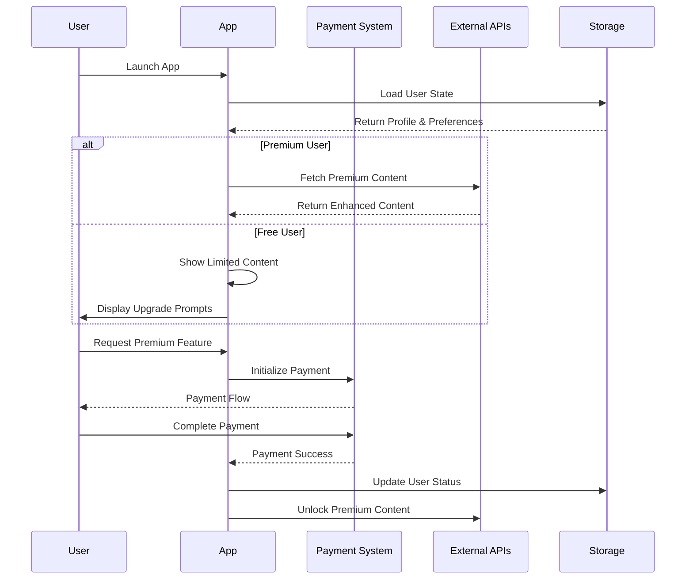
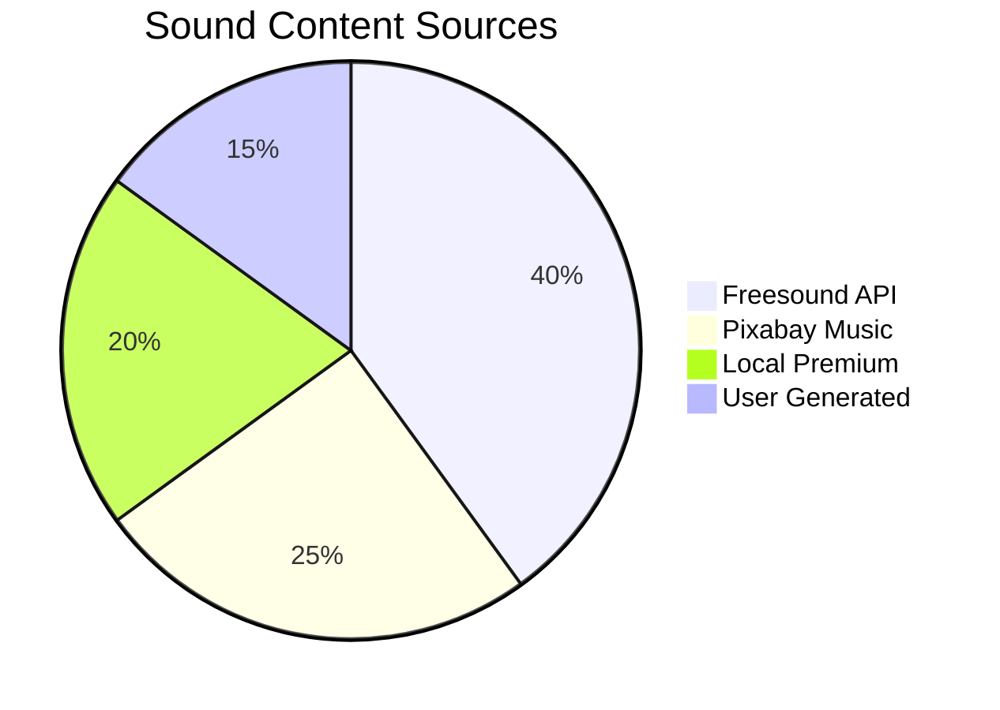
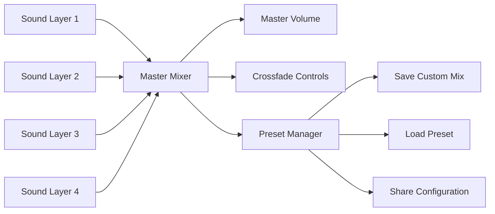
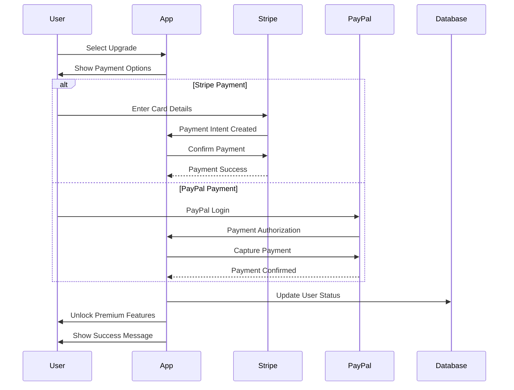
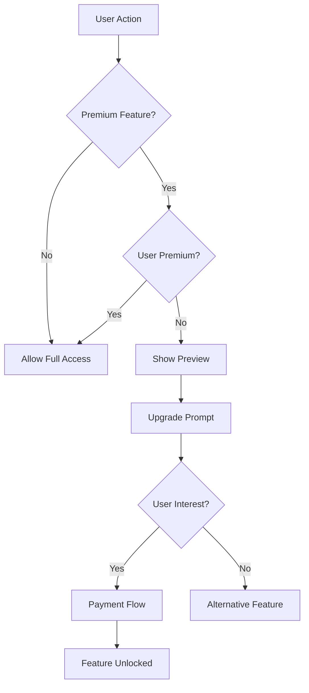
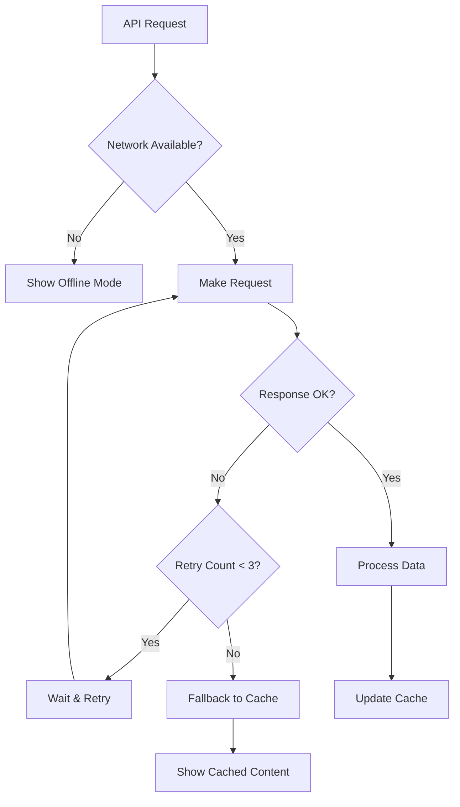

# NeuroFlow API Integration & Premium Upgrade Design

## Overview

This design document outlines the transformation of NeuroFlow from a basic demo app into a production-ready, profitable ADHD productivity platform through strategic API integrations, enhanced user experience, and a compelling freemium monetization model.

### Strategic Objectives

- **Revenue Generation**: Implement dual-tier pricing ($5 base + $5 guidebook upgrade)
- **User Retention**: Expand content library with 50+ ambient sounds and comprehensive guidebooks
- **Technical Excellence**: Integrate premium APIs for TTS, audio, and visual content
- **Market Positioning**: Create a premium neurodivergent-friendly productivity ecosystem

## Technology Stack & Dependencies

### Current Foundation
- **Frontend Framework**: React 18 with TypeScript
- **UI Libraries**: Framer Motion, Tailwind CSS, Lucide React
- **Audio Management**: use-sound, react-spring
- **Build System**: Vite with PWA capabilities
- **Payment Processing**: Stripe SDK (pre-installed)

### New API Integrations
- **Text-to-Speech**: Google Cloud TTS, Azure TTS, Piper TTS
- **Audio Content**: Freesound API, Pixabay Music API
- **Visual Content**: Unsplash API, Pexels API, AI-generated images
- **Payment Systems**: Stripe Checkout, PayPal SDK

## Architecture

### Component Hierarchy Enhancement

### Data Flow Architecture

## API Integration Layer

### Text-to-Speech Service Architecture

#### Service Provider Strategy

| Provider | Free Tier | Quality | Use Case |
|----------|-----------|---------|----------|
| Browser API | Unlimited | Standard | Basic narration, fallback |
| Google Cloud TTS | 1M chars/month | Neural | Premium guides, meditation |
| Azure TTS | 500K chars/month | Neural | Alternative premium option |
| Piper TTS | Unlimited | High | Offline capability |

#### TTS Voice Selection Matrix

| Voice Type | Language | Provider | Premium Required | Quality Level |
|------------|----------|----------|------------------|---------------|
| Basic System | en-US | Browser | No | Standard |
| Neural Enhanced | en-US | Google | Yes | Premium |
| Studio Quality | en-US | Azure | Yes | Neural |
| Offline Capable | en-US | Piper | No | High |

### Audio Content Service Architecture

#### Sound Library Expansion Strategy

**Current State**: 30 hardcoded sounds with limited variety
**Target State**: 50+ dynamic sounds from multiple API sources

#### Content Source Distribution

#### Sound Category Enhancement

| Category | Free Sounds | Premium Sounds | API Source | Content Examples |
|----------|-------------|----------------|------------|------------------|
| Nature | 5 basic | 15 enhanced | Freesound | Forest ambience, ocean waves, thunderstorms |
| Ambient | 3 basic | 12 enhanced | Pixabay | Space sounds, ethereal drones, cosmic winds |
| Focus | 4 basic | 8 enhanced | Freesound | Binaural beats, theta waves, noise variants |
| Meditation | 2 basic | 10 enhanced | Both APIs | Singing bowls, temple bells, guided breathing |
| Urban | 1 basic | 5 enhanced | Freesound | Coffee shop, library, train journey |

### Visual Content Service Architecture

#### Image Content Strategy

**Purpose**: Enhance guidebook content and theme backgrounds
**Sources**: Unsplash (primary), Pexels (secondary), AI-generated (future)

#### Content Categories & Usage

| Content Type | API Source | Usage Context | Quality Requirements |
|--------------|------------|---------------|---------------------|
| Meditation Backgrounds | Unsplash | Zen Mode, Breathing Exercises | High-res, calming aesthetics |
| Productivity Visuals | Pexels | Task Manager, Focus Sessions | Clean, motivational imagery |
| Nature Imagery | Both APIs | Sound Library, Ambient Themes | Natural lighting, serene compositions |
| Infographics | AI-Generated | Guidebook Content | Educational, accessible design |

## Enhanced User Experience Design

### Dark Mode & Theme System

#### Current Issues
- Dark mode lacks polish with insufficient contrast ratios
- Theme switching doesn't persist properly across sessions
- Limited customization options

#### Enhanced Theme Architecture

**Theme Structure**:
- **Dark Base**: True dark backgrounds (#0a0a0a, #1a1a1a)
- **Gradient Highlights**: Colorful accents for engagement
- **Accessibility Compliance**: WCAG 2.1 AA standards
- **Persistence Strategy**: localStorage + user preferences API

#### Theme Configuration Matrix

| Theme Variant | Background | Primary | Accent | Text | Persistence |
|---------------|------------|---------|--------|------|-------------|
| Light | #ffffff | #2563eb | #06b6d4 | #1f2937 | localStorage |
| Dark Enhanced | #0a0a0a | #3b82f6 | #10b981 | #f9fafb | user_profile |
| Colorful | #1a1a2e | Gradient | #e91e63 | #ffffff | premium_only |

### Sound Mixer Enhancement

#### Current Limitations
- Single sound playback only
- No volume control per sound
- Limited sound library

#### Enhanced Mixer Architecture

**Features**:
- **Multi-layer Mixing**: Combine up to 4 simultaneous sounds
- **Individual Volume Controls**: Granular audio management
- **Custom Presets**: Save and share sound combinations
- **Crossfade Transitions**: Smooth sound transitions

#### Mixer Interface Design

### Guidebook Content Strategy

#### Current State Analysis
- Basic static content with minimal engagement
- No interactive elements or multimedia integration
- Limited educational value

#### Enhanced Content Architecture

**Content Pillars**:
1. **Interactive Learning Modules**: Step-by-step ADHD management techniques
2. **Multimedia Integration**: Video, audio, and interactive elements
3. **Progress Tracking**: User engagement and completion metrics
4. **Personalization**: Adaptive content based on user preferences

#### Content Development Matrix

| Module Category | Free Access | Premium Features | Interactive Elements | TTS Integration |
|-----------------|-------------|------------------|---------------------|-----------------|
| Basic ADHD Tips | Full access | Enhanced detail | Simple checkboxes | Browser TTS |
| Focus Techniques | Previews only | Complete guides | Interactive exercises | Premium TTS |
| Time Management | Limited | Full methodology | Progress tracking | Neural voices |
| Emotional Regulation | Basic info | Detailed strategies | Mood tracking | Personalized |

### Payment System Architecture

#### Dual-Tier Pricing Model

**Tier 1 - Base Access ($5)**:
- Complete app functionality
- Basic sound library (25 sounds)
- Standard TTS voices
- Limited guidebook previews

**Tier 2 - Full Premium ($10 total)**:
- Expanded sound library (50+ sounds)
- Premium TTS voices
- Complete guidebook access
- Custom sound mixing
- Advanced themes

#### Payment Flow Architecture

#### Revenue Optimization Strategy

**Conversion Funnel**:
1. **Free Trial Experience**: 7-day full access trial
2. **Strategic Feature Gating**: Core features free, premium enhancements paid
3. **Value Demonstration**: Show locked features with preview content
4. **Urgency Creation**: Limited-time upgrade offers

## Business Logic Layer

### User Journey Enhancement

#### Onboarding Flow Optimization

**Phase 1 - Welcome & Assessment**:
- ADHD-specific questionnaire for personalization
- Feature discovery with interactive tutorials
- Immediate value demonstration

**Phase 2 - Engagement Building**:
- Progressive feature unlocking
- Achievement system integration
- Social proof elements

**Phase 3 - Monetization**:
- Strategic upgrade prompts at peak engagement
- Value-based messaging for premium features
- Multiple payment options for accessibility

### Feature Gating Strategy

#### Smart Limitation System

#### Limitation Examples

| Feature Category | Free User Experience | Premium Unlock |
|------------------|---------------------|----------------|
| Sound Library | 5 sounds per category | Unlimited access |
| TTS Voices | Browser voices only | Neural & premium voices |
| Guidebooks | Chapter previews | Full content access |
| Sound Mixing | Single sound playback | Multi-layer mixing |
| Custom Themes | Light/Dark only | Gradient & animated themes |

### Analytics & Optimization

#### User Behavior Tracking

**Key Metrics**:
- Feature usage frequency
- Session duration and engagement
- Conversion funnel performance
- Payment completion rates

**Optimization Triggers**:
- A/B testing for upgrade prompts
- Dynamic pricing based on user behavior
- Personalized content recommendations

## Testing Strategy

### Integration Testing Framework

#### API Testing Strategy

**Test Categories**:
1. **API Reliability**: Connection stability and error handling
2. **Content Quality**: Audio/image quality validation
3. **Rate Limiting**: API quota management
4. **Fallback Systems**: Graceful degradation testing

#### Payment Testing Matrix

| Test Scenario | Stripe Test | PayPal Test | Expected Outcome |
|---------------|-------------|-------------|------------------|
| Successful Payment | Valid card | Valid account | Feature unlock |
| Failed Payment | Declined card | Insufficient funds | Retry flow |
| Partial Payment | Processing error | Connection timeout | Error handling |
| Refund Request | Admin refund | User dispute | Status update |

### User Experience Testing

#### Accessibility Validation

**ADHD-Specific Considerations**:
- Attention span optimization (max 3-click navigation)
- Sensory sensitivity accommodation
- Cognitive load reduction
- Clear visual hierarchy

**Testing Protocol**:
- Screen reader compatibility
- Keyboard navigation flow
- Color contrast validation
- Motion sensitivity options

## Distribution Strategy

### Platform Deployment Plan

#### Multi-Platform Distribution

| Platform | Package Format | Pricing Model | Distribution Method |
|----------|----------------|---------------|---------------------|
| Google Play | AAB | Freemium | Play Console |
| Gumroad | Web App | One-time payment | Direct download |
| LemonSqueezy | PWA | Subscription option | Digital delivery |
| Payhip | Desktop App | Tiered pricing | License key system |

#### Marketing Integration

**Launch Strategy**:
1. **Soft Launch**: Beta testing with ADHD communities
2. **Content Marketing**: Educational blog posts and tutorials
3. **Social Proof**: User testimonials and case studies
4. **Partnership Strategy**: ADHD coaches and mental health professionals

### Revenue Projections

#### Financial Modeling

**Conservative Estimates**:
- Month 1-3: 100 users, 15% conversion rate → $150/month
- Month 4-6: 500 users, 20% conversion rate → $1,000/month
- Month 7-12: 2,000 users, 25% conversion rate → $5,000/month

**Growth Multipliers**:
- Referral program: +30% user acquisition
- Content marketing: +50% organic growth
- Partnership deals: +25% targeted conversions

## Critical Bug Fixes & Improvements

### High Priority Issues Identified

#### 1. Audio System Reliability Issues

**Current Problems**:
- Multiple `AudioContext` instances created without proper cleanup
- Audio generation methods create memory leaks with continuous oscillators
- No proper error handling for audio API failures
- Browser autoplay policies not properly handled

**Solutions Required**:
- Implement singleton `AudioManager` service with proper lifecycle management
- Add audio context state management (suspended/running)
- Implement proper cleanup for all audio sources
- Add user gesture requirement detection and handling

#### 2. Text-to-Speech Integration Gaps

**Current Problems**:
- TTS service lacks proper voice loading verification
- Premium voice simulation is overly complex and unreliable
- No fallback mechanism when system voices fail
- Voice selection doesn't persist across sessions

**Solutions Required**:
- Implement voice availability detection with loading states
- Simplify premium voice simulation with clear API integration points
- Add robust fallback to browser's default voice
- Store TTS preferences in user profile with proper synchronization

#### 3. State Management Inconsistencies

**Current Problems**:
- Theme persistence conflicts between localStorage and app state
- User preferences not properly synchronized across components
- Demo limitations inconsistently applied across features
- Payment state transitions lack proper validation

**Solutions Required**:
- Implement centralized state management with React Context
- Create unified preference synchronization system
- Add consistent demo limitation enforcement
- Implement state machine for payment flows

#### 4. Component Architecture Issues

**Current Problems**:
- Heavy components with multiple responsibilities
- Duplicate audio generation logic across components
- Inconsistent error handling patterns
- Missing proper TypeScript type safety in several areas

**Solutions Required**:
- Refactor into smaller, focused components
- Extract shared audio logic into reusable services
- Implement consistent error boundary pattern
- Add comprehensive TypeScript interfaces for all data flows

### API Integration Enhancements

#### Enhanced Error Handling Strategy

#### API Service Reliability Matrix

| Service | Primary Provider | Fallback | Offline Mode | Cache Strategy |
|---------|------------------|----------|--------------|----------------|
| TTS | Google Cloud TTS | Browser API | Text display | None |
| Audio | Freesound API | Local generation | Silence mode | 24h cache |
| Images | Unsplash API | Placeholder images | Default theme | 7d cache |
| Payment | Stripe | PayPal | Feature lock | State persist |

### Performance Optimization Requirements

#### Memory Management

**Current Issues**:
- Audio buffers not properly released
- Component state causing unnecessary re-renders
- Large image assets not optimized

**Optimization Strategy**:
- Implement proper audio buffer pooling
- Add React.memo and useMemo optimizations
- Integrate image optimization service
- Add lazy loading for non-critical components

#### Bundle Size Optimization

**Target Metrics**:
- Initial bundle: < 150KB gzipped
- Audio libraries: < 50KB additional
- Image assets: < 100KB total
- Font loading: < 20KB

### Testing Strategy Enhancement

#### Critical Test Coverage Areas

| Component Category | Current Coverage | Target Coverage | Priority Tests |
|--------------------|------------------|-----------------|----------------|
| Audio System | 0% | 80% | Audio context lifecycle, memory leaks |
| TTS Integration | 0% | 70% | Voice loading, fallback scenarios |
| Payment Flow | 0% | 95% | State transitions, error handling |
| API Services | 20% | 85% | Network failures, rate limiting |
| State Management | 30% | 90% | Persistence, synchronization |

#### Testing Implementation Requirements

**Unit Tests**:
- Audio service lifecycle management
- TTS voice selection and fallback
- Payment state machine transitions
- API error handling and retries

**Integration Tests**:
- Complete user purchase flow
- Audio mixing with multiple sources
- Theme persistence across sessions
- Offline mode functionality

**Performance Tests**:
- Memory usage during audio playback
- Bundle loading times
- API response time handling
- Component rendering optimization

### Security & Privacy Enhancements

#### Data Protection Requirements

**User Data Handling**:
- Implement proper data encryption for stored preferences
- Add clear privacy policy for audio/usage data
- Ensure GDPR compliance for EU users
- Implement data export functionality

**API Security**:
- Add proper API key rotation mechanism
- Implement request signing for sensitive operations
- Add rate limiting protection for user actions
- Ensure secure payment data handling

### Accessibility Compliance Gaps

#### ADHD-Specific Requirements

**Current Gaps**:
- No focus management for attention difficulties
- Audio controls lack keyboard navigation
- Color contrast issues in gradient themes
- No motion reduction options

**Implementation Requirements**:
- Add focus trap management for modal interactions
- Implement comprehensive keyboard navigation
- Ensure AA-level color contrast in all themes
- Add `prefers-reduced-motion` support

**Screen Reader Support**:
- Add ARIA labels for all interactive elements
- Implement proper heading hierarchy
- Add live regions for dynamic content updates
- Ensure semantic HTML structure throughout

### Performance Monitoring & Analytics

#### Key Metrics to Track

**Technical Metrics**:
- Audio context creation/destruction cycles
- Memory usage patterns during extended use
- API failure rates and fallback usage
- Component render performance

**User Experience Metrics**:
- Feature adoption rates (premium vs free)
- Session duration and engagement patterns
- Error frequency and user recovery actions
- Conversion funnel performance

### Deployment & Distribution Improvements

#### Progressive Web App Enhancements

**Current Limitations**:
- No offline functionality for core features
- Missing app manifest optimizations
- No background sync capability
- Limited push notification support

**Enhancement Requirements**:
- Implement service worker for offline mode
- Add proper PWA manifest with all required fields
- Integrate background sync for data persistence
- Add push notification system for reminders

#### Multi-Platform Distribution Strategy

**Platform-Specific Optimizations**:
- **Web**: PWA with offline capabilities
- **Mobile**: Capacitor integration for native features
- **Desktop**: Electron wrapper with system integration
- **Tablets**: Responsive design optimizations

## Risk Management

### Technical Risk Mitigation

#### API Dependency Management

**Risk**: External API service disruption
**Mitigation**: Multi-provider fallback system with local caching and offline mode

**Risk**: Audio system memory leaks causing crashes
**Mitigation**: Comprehensive audio lifecycle management with automatic cleanup

**Risk**: Payment processing failures
**Mitigation**: Multiple payment providers with retry logic and state persistence

**Risk**: Browser compatibility issues with audio APIs
**Mitigation**: Progressive enhancement with feature detection and polyfills

### User Experience Risk

#### ADHD-Specific Considerations

**Risk**: Cognitive overload from complex interfaces
**Mitigation**: Progressive disclosure with simplified default views

**Risk**: Attention drift during long processes
**Mitigation**: Chunked interactions with clear progress indicators

**Risk**: Sensory sensitivity to audio/visual elements
**Mitigation**: Comprehensive accessibility controls and sensory preferences

**Risk**: Difficulty with payment completion
**Mitigation**: Single-click upgrade flow with clear value demonstration

This enhanced design document provides comprehensive guidance for transforming NeuroFlow into a production-ready, accessible, and profitable ADHD productivity platform while addressing critical technical debt and user experience issues.